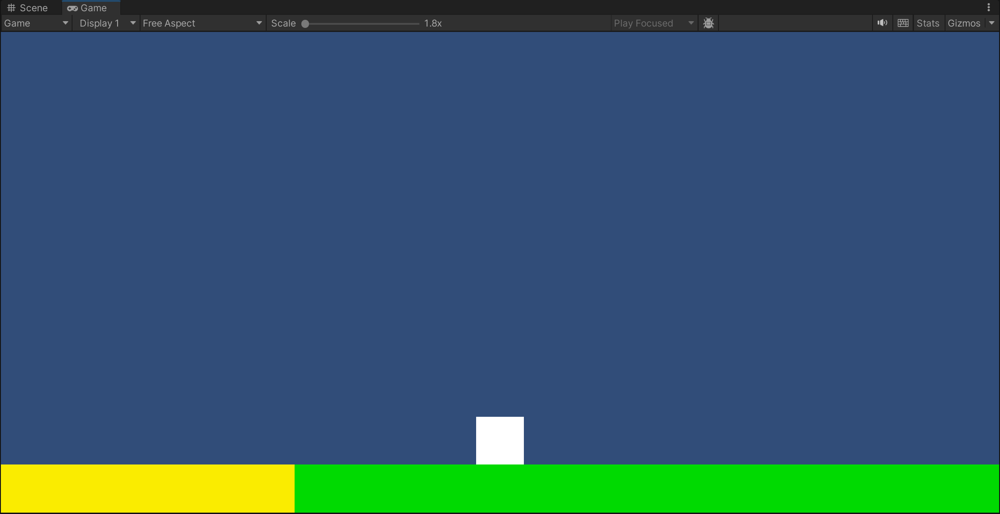
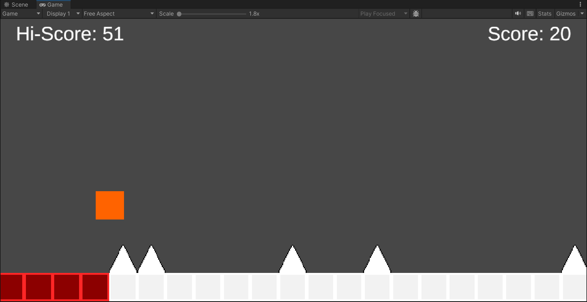
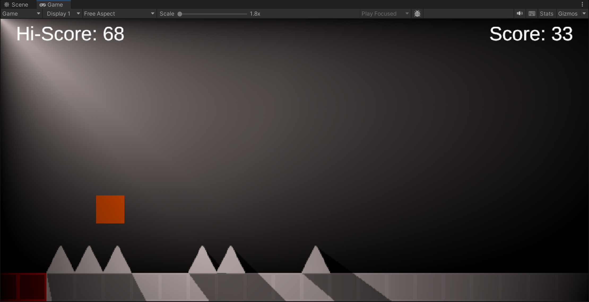

# Alex NaN

Alex NaN is a 2D endless runner game created with Unity.

## To Do List

### Graphics

#### Shaders

- Add shaders to the background
- Add shaders to the cells to make it glow
  - Already tried to attempt this, but failed
  
#### Lighting

- ~~Add shadow casting to the existing lighting system~~
- If necessary, use a better lighting system
  - So far using 2D directional spotlight as an environmental light
  
#### Particles

- Add a particle system
  - Particles for player death
  - Particles for player jump
  - Maybe add trails for particles
  
#### Tiles

- I do not see a use for a tilemap at the moment

#### Sprites

- ~~Change the player sprite from a square to something else~~
- Add the drone for the lighting and flashing
- Add a diegetic battery bar

### UI

- Nothing necessary right now

### Code

- ~~Serialize things that should be changed~~
- ~~Unserialize things that stay constant~~
- Add an optional double jump back into the player script
  - It could be an upgrade
  
### Gameplay

#### Items

- Add wall jumping once there are walls in the game
- Add some collectibles such as charges to collect on alternative paths
- Make the spike chance increase over time
- Make the spike encounter more difficult over time (more triple spikes)
- Old ideas that might not be implemented
  - Bees swarm the player after a certain point, must shoot them using battery power
  - Add an option to remove spikes somehow, incentivized by impossible spikes
    - May spawn quadruple spikes
    - Could shoot them with a laser that wastes battery
	
#### Upgrades

- Not thought of at the moment

#### Map design

- Need a pool of possible cell configurations
  - So far it is a straight line
  - I am thinking mountains, caves, hills, parallel straight lines, and vertical walls
- Need more obstacles
  - i.e., lava and then have it glow with lighting/shaders

## Alex To Do

- Make batteries
- Make camera follow player's height
- Anchor nanoid to alexoid

## Henry To Do

- Make sprites for cells, spikes, lava, etc
- ~~Make collision with walls work~~
- Organize background layers
- Fix background ambient lighting
- Make upper and lower background layers (sky, space, underground, hell)

## Kaitlyn To Do

- Make sure platforms are hollowed out
- Pitfalls
- Different elevation stuff
- Make optional preset configurations (more predictable)
- Add slopes

## Snapshots

## Credits

Alex Akoopie

Henry Nan

Kaitlyn Corpuz