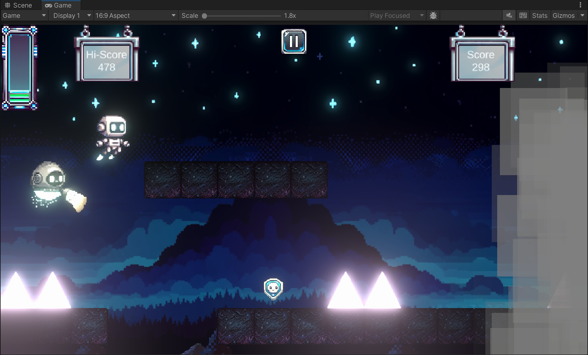

# Alex NaN
Alex NaN is a 2D endless runner game created with Unity.
Web version https://64yomi.itch.io/alex-nan-demo

## Premise
Two robots, Alexoid and their trusty support unit, NaNoid, are navigating through the mysterious twilight forest, where malevolent glowing triangular structures pierce the darkness like ancient monuments. The pixel-perfect night sky looms above them, painted in deep blues and purples, while an ominous moon casts an ethereal glow across the landscape.

As they progress through this cybernetic wilderness you (the player) must guide them to safety. You must carefully time their jumps, for one miscalculation could reset their entire journey.

## Features
Here are the features that the game currently utilizes:
- Randomly generated platforms and hazards
- Fog that obscures vision
  - Along with a device to hinder it 
- Powerups and pickups
- Parameterized difficulty properties
- Directional lighting and shadowcasting
- Lightweight collision detection
- Background parallax
- Music, sounds, and settings
- Death

## Upcoming features
Some of the features we wish to implement in the future include:
- Object pooling
- Custom shaders
- Diagetic UI design

## Snapshots

### Version 1

### Version 2

### Version 3

### Version 4

## Credits
Alex Akoopie

Henry Nan

Kaitlyn Corpuz
